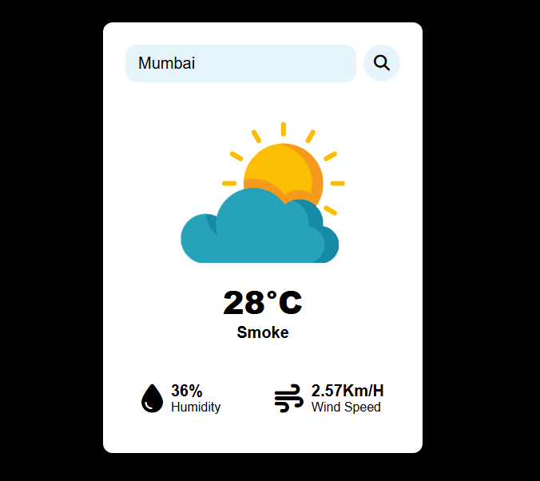

# 🌤️ WeatherNow — Real-Time Weather App

> 🔗 Live Demo: [WeatherNow Live](https://sushantshinde7.github.io/Weather-App/)  
> 📦 Repository: [weather-app](https://github.com/sushantshinde7/Weather-App)


A modern, responsive weather dashboard delivering accurate real-time data with a clean glassmorphism UI.

WeatherNow is a lightweight weather web app that provides real-time weather insights for any city using the OpenWeather API, with a focus on clarity, usability, and fast access to essential metrics.

---

## 🎥 Preview



---

## 📌 Features

- Search weather by city name with instant results  
- View temperature, humidity, wind speed, visibility, and cloud cover  
- Displays sunrise and sunset times clearly  
- Shows Air Quality Index with color-coded status  
- Gracefully handles invalid or unknown city searches  
- Displays last updated timestamp for freshness  
- Retains last searched city using LocalStorage  
- Detects offline state and shows a dismissible banner  
- Accessible markup with ARIA labels  
- Clickable title for soft data refresh  

---

## 🎨 UI & UX Highlights

- Glassmorphism-inspired layout with clean visual hierarchy  
- Dynamic weather icons based on live conditions  
- Smooth transitions and subtle animations  
- Mobile-first, fully responsive design  

---

## 🛠️ Tech Stack

- HTML5 for semantic structure  
- CSS3 for layout, responsiveness, and UI styling  
- JavaScript (ES6+) for logic and API handling  
- OpenWeather API for live weather data  
- Fetch API for network requests  
- LocalStorage for persistence  

---

## 🚀 Getting Started

1. Clone the repository  
   ```sh
   git clone https://github.com/sushantshinde7/Weather-App.git
   ```

2. Navigate to the project directory  
   ```sh
   cd Weather-App
   ```

3. Open the app  
   - Open `index.html` directly in your browser  
   - OR use the **Live Server** extension in VS Code  

---

## 🌍 API Configuration

This project uses the **OpenWeather API**.

To use your own API key:

1. Sign up at https://openweathermap.org  
2. Generate an API key  
3. Replace the key in `app.js`:

   ```js
   const api_key = "YOUR_API_KEY";
   ```

---

## 📈 Future Improvements

- Hourly and 7-day weather forecast  
- Location-based weather detection  
- Celsius / Fahrenheit toggle  
- Progressive Web App (PWA) support  

---

## 👤 Author

**Sushant Shinde**  
GitHub: https://github.com/sushantshinde7  
LinkedIn: https://www.linkedin.com/in/sushantshinde7/

---

## 📄 License

This project is licensed under the **MIT License**.
