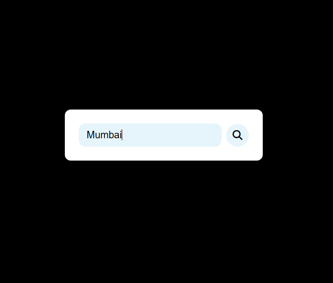

🌤️ WeatherNow
A sleek and responsive web application that provides real-time weather updates based on city name search. Built with HTML, CSS, and JavaScript, it uses the OpenWeather API to display live weather conditions, including temperature, humidity, wind speed, sunrise, sunset, and weather descriptions with icons.

## 🚀 Live Demo
🔗 [Weather App](https://sushantshinde7.github.io/Weather-App/)
### 📌 Features

| ✅ Core Features                           | 💡 Enhanced UX & Styling                     |
|--------------------------------------------|-----------------------------------------------|
| 🔍 Search weather by city name             | 🎨 Glassy UI with icon feedback              |
| 🌡️ Temperature, Humidity, Wind, etc.       | 🕒 Last updated time below stats             |
| 🌇 Sunrise & Sunset times                  | 🖼️ Dynamic weather icons                     |
| ☁️ Cloud cover & 👁️ Visibility            | 📶 Offline support with dismissible banner   |
| 🌫️ Dynamic weather description popup       | 🔠 ARIA labels and accessible markup         |
| 🌬️ AQI with label, level & color badge     | 💾 Retains last city using `localStorage`    |
| 🚫 Handles errors and invalid cities       | 🔁 Click title to reset and soft refresh     |


## 🛠️ Tech Stack
- **Frontend**: HTML, CSS, JavaScript  
- **API**: OpenWeather API  
- **Other Tools**: Fetch API  

## 🔧 Installation
Follow these steps to set up the project locally:

1. Clone the repository:
   ```sh
   git clone https://github.com/sushantshinde7.github.io/weather-app.git
Navigate to the project directory:
sh
Copy
Edit
cd weather-app
Open index.html in your browser.

🌍 API Usage
This app uses the OpenWeather API to fetch real-time weather data.
To use it with your own API key:
Sign up on OpenWeather and get an API key.
Replace "YOUR_API_KEY" in the JavaScript file with your actual API key.

🖼️ Screenshots
### Home Page  


### Weather Search Example  


🤝 Contributing
If you’d like to contribute:

Fork this repository.
Create a feature branch (git checkout -b feature-name).
Commit your changes (git commit -m "Add new feature").
Push to your branch (git push origin feature-name).
Open a Pull Request.

⭐ If you like this project, consider giving it a star on GitHub! ⭐


🙏 Thank You
Made with ❤️ by Sushant Shinde
